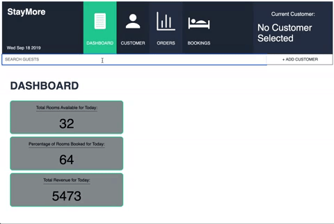

# Overlook Project

## Table of contents
* Built With 
* Screenshots
* Features
* Try It Out
* Take It For A Spin
* Why'd We Do This?

## Built With

- HTML5
- CSS3
- SASS
- JavaScript
- JQuery
- TDD (CHAI, MOCAH, SPIES)
- OOP
- Fetch API

## Screenshots

- Overlook allows us to design and create the UI/UX
  
### Actual:
  

## Features

- [x] Search through and compare data from different sources
- [x] Fetch data four different data sets
- [x] Search through Existing customers
- [x] Create new Customer
- [x] Create booking for new & existing customers
- [x] Create new food orders for new and existing customers

## Try It Out

- Want to know what it's like to manage a simms hotel?

1. View Total revenue for day of.

2. View Total Room Service for day of.

3. Total revenue updates as rooms are booked and food items are added.

4. Can go back and forth between customers while data persists(not over page reload) between customers switches and tab swtiches.

## Take It For A Spin

View <a href=http://matthewdshepherd.github.io/overlook/>here</a> on GitHub.

## Why'd I Do This?

I am a student at Turing School of Software and Design, whom provioded the project specifications and website design. I am learning all the things on my way to becoming a Software Engineer.
